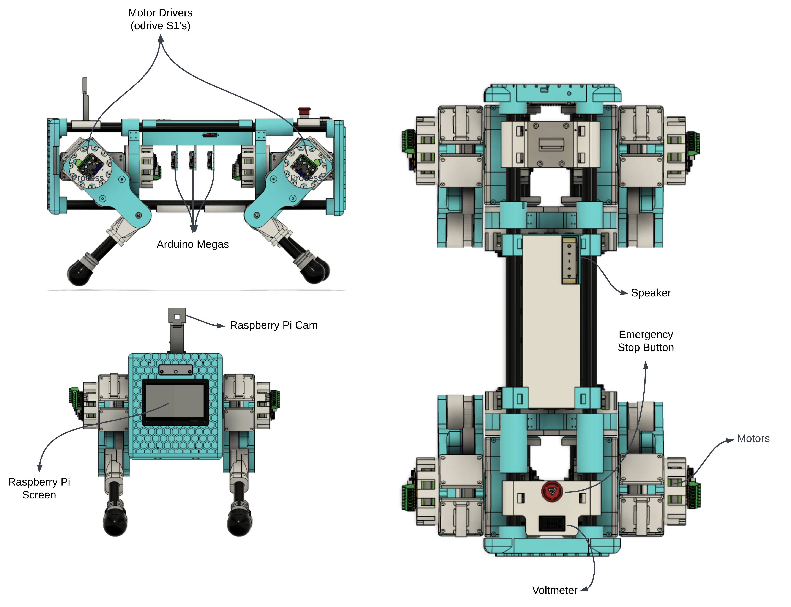
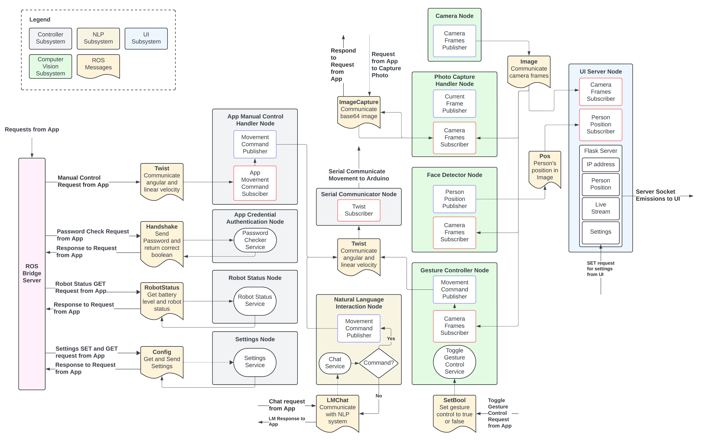

# DASH: Quadruped Development Kit

Welcome to the official GitHub repository for DASH, a meticulously designed quadruped robot that combines state-of-the-art hardware and software to provide advanced interaction capabilities.

## Overview

DASH is a cost-effective quadruped robot that goes beyond basic locomotion to include a range of advanced features. The project involves comprehensive processes from 3D modeling, printing, and assembly to the integration of sophisticated software and hardware systems.

## Features

- **Advanced Locomotion**: Utilizing sophisticated motor drivers, encoders, and kinematic modeling to achieve stable and dynamic movement.
- **AI Functionalities**: Includes gesture control, person following, and natural language interaction.
- **User Interaction**: Equipped with a touchscreen display and a camera for vision-based systems.
- **Remote Control**: Custom-built app for seamless remote control and interaction.
- **ROS2 Integration**: Core functionalities served on a ROS2 system to ensure robust and flexible operation.

### Hardware

DASH's hardware components are meticulously connected and integrated to ensure smooth and precise operation. This includes:

- **Motors and Encoders**: For precise movement and control.
- **Sensors**: Various sensors to provide the robot with environmental awareness.
- **Touchscreen Display**: For direct user interaction.
- **Camera**: For vision-based systems and AI functionalities.

### Software

The software aspect of DASH involves developing robust applications to integrate with hardware functions and enhance user experience through dedicated UIs. This includes:

- **AI Capabilities**: Implementing advanced AI functionalities to provide interactive features.
- **Custom-Built App**: Allowing users to control the robot and its functionalities remotely.
- **ROS2 System**: Ensuring seamless integration and operation of various components.

## Usage

- The 3D print is available in the `3D_model.zip file`. (inspired by <a href='https://github.com/XRobots/openDogV3'>OpenDogV3</a>)
- The `/ML` foilder contains the script and the dataset to train the intent determiner
- The `/ros` folder contains the ROS2 workspace.
- The `/dash_app` folder contains the code for the flutter app.
- The `/Arduino` folder contains the code for the arduinos used for the build.
